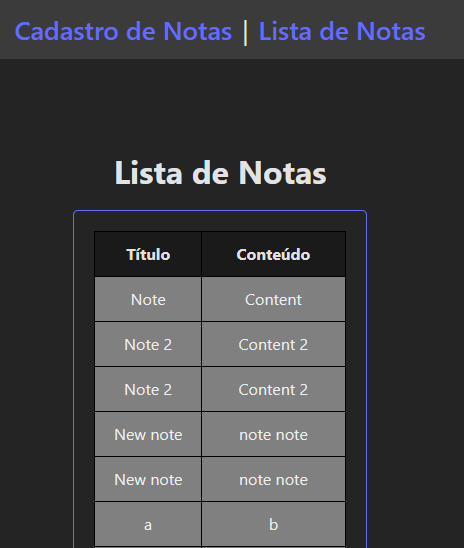

# Gerenciador de Notas 

[Tecnologias](#tecnologias) | [Funcionalidades](#funcionalidades) | [Descrição](#descrição) | [Instalação](#instalação) | [Avisos](#avisos) | [Imagens](#imagens) | [Suporte](#suporte) | [Lista de bugs](#lista-de-bugs) | [Bugs Resolvidos](#bugs-resolvidos)

## Tecnologias

### Frontend
<ul>
  <li>Vue</li>
  <li>Pinia</li>
  <li>Oh, Vue Icons!</li>
  <li>Vue Router</li>
</ul>

### Backend
<ul>
  <li>Node</li>
  <li>Nest.js</li>
</ul>

[Ir para o topo](#gerenciador-de-notas)

## Funcionalidades

- &check; 
- &#x2610; 


[Ir para o topo](#gerenciador-de-notas)

## Descrição


[Ir para o topo](#gerenciador-de-notas)

## Instalação

1. Faça um clone dos repositórios do projeto:

```bash
git clone git@github.com:rushxpush/gerenciador-notas.git
git clone git@github.com:rushxpush/gerenciador-notas-frontend.git
git clone git@github.com:rushxpush/gerenciador-notas-backend.git
```

2. Entre na pasta do repositório central
```bash
cd gerenciador-notas
```

3. Monte a imagem e rode:
```bash
docker compose up --build
```

4. Acesse a página em [localhost:8080](http://localhost:8080)

[Ir para o topo](#gerenciador-de-notas)

## Avisos

Futuros avisos

[Ir para o topo](#gerenciador-de-notas)

## Imagens





## Suporte

Qualquer dúvida mande um email para [rafagarciadev@gmail.com](mailto:rafagarciadev@gmail.com)

[Ir para o topo](#gerenciador-de-notas)

## Lista de bugs

- &#x2610; Acessar qualquer link que não seja http://localhost:8080 na barra de navegação gera um erro de página não encontrada (falta configurar o servidor para dar suporte ao Vue Router)

[Ir para o topo](#gerenciador-de-notas)

## Bugs Resolvidos

[Ir para o topo](#gerenciador-de-notas)